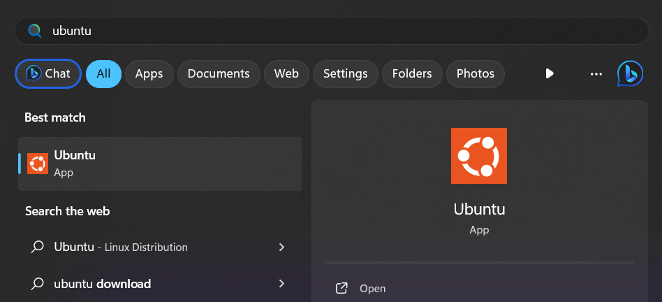
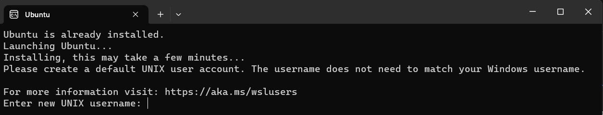
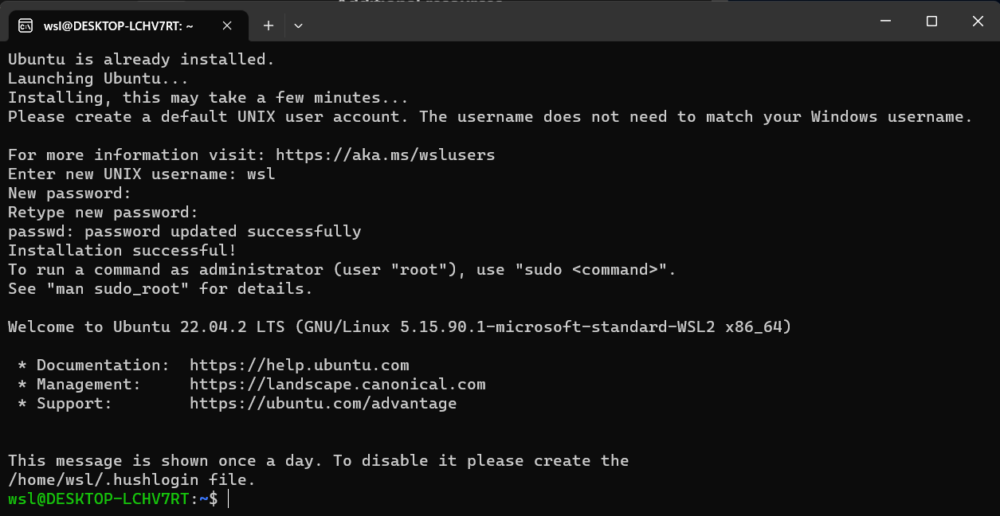

# Setting up Linux

## Initial Setup

Once WSL has been installed, reboot your computer. This step is important to ensure it is setup completely.

After rebooting, if Ubuntu does not open automatically then open the Ubuntu app from the start menu.

You will be prompted to set up an account for your Linux system, so go ahead and do this.

- Note that when creating a password, nothing will appear on screen. This is called "blind typing" and this is completely normal.

- Once you create an account, this will be your default user and automatically sign-in on launch.

- This account will be considered the Linux administrator, with the ability to run `sudo` administrative commands.

