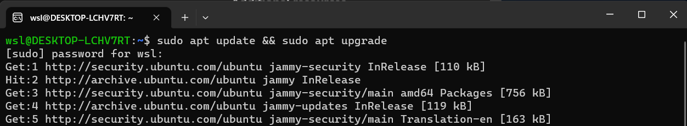
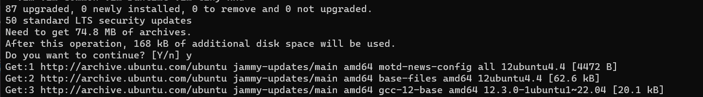
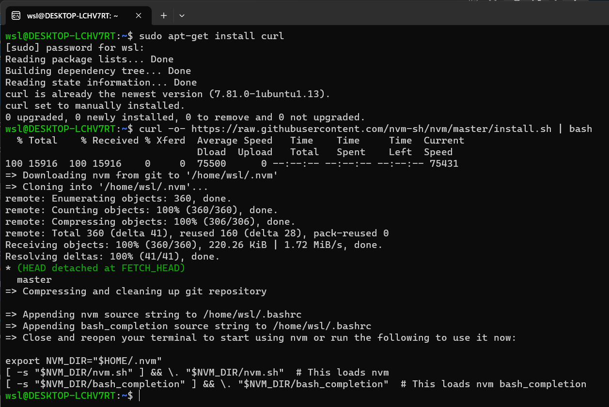
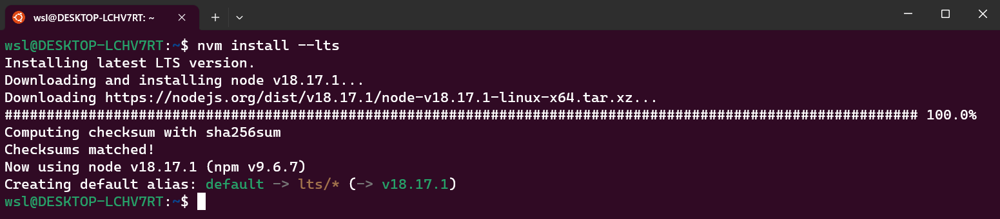

# Update Packages & Install Node

## Ensure packages are up to date

It is recommended that you check for package updates after installing. Windows does not update or upgrade these automatically, so to do this manual process you should run:

```
sudo apt update && sudo apt upgrade
```

in your ubuntu shell. It will ask for your password and then permission to install.





## Install NodeJS & npm via nvm (Node Version Manager)

It is recommended to use a node version manager when installing NodeJS. The reason for this is that you will likely require different node versions based on the needs of the project you are working on. NVM easily allows us to switch between different versions on the fly.

Open your Ubuntu WSL command line and enter the below command to install cURL, a tool used to donload content from the internet in the command line.

```
sudo apt-get install curl
```

Once installed, enter the below to install nvm.

```
curl -o- https://raw.githubusercontent.com/nvm-sh/nvm/master/install.sh | bash
```



For this new install to take effect, you're going to need to close the terminal and open a new one.

Now let's install the latest LTS version of node, by entering

```
nvm install --lts
```

