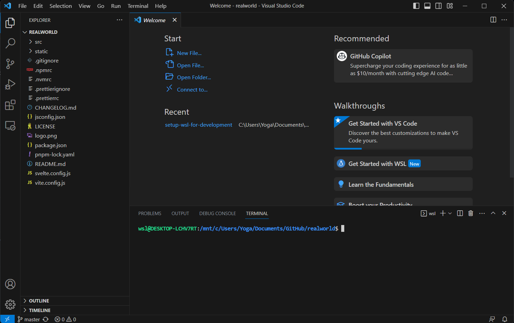
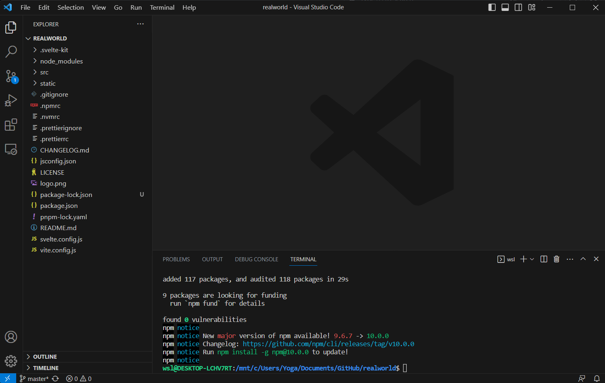
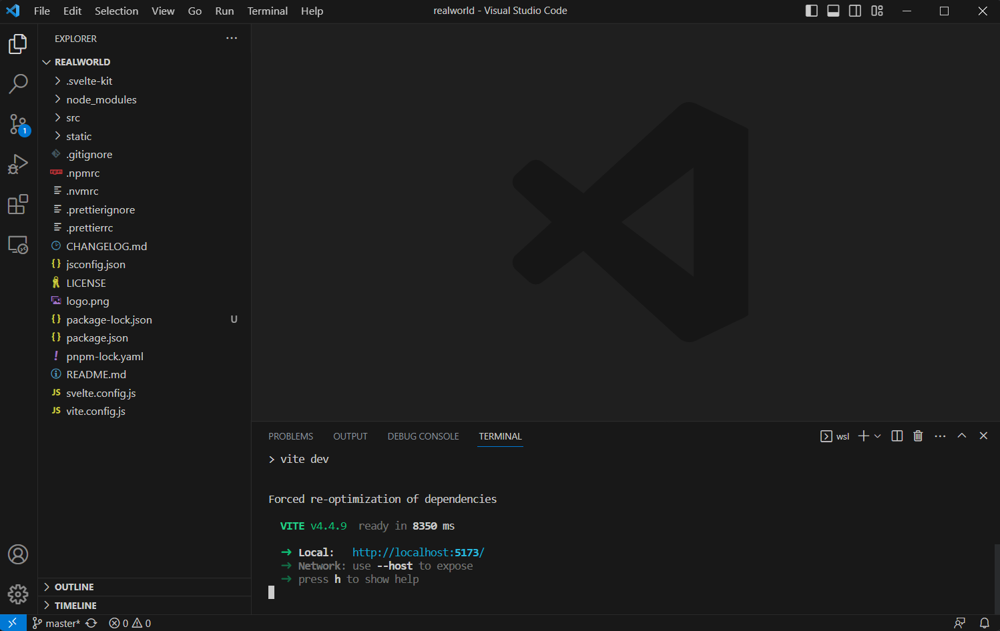
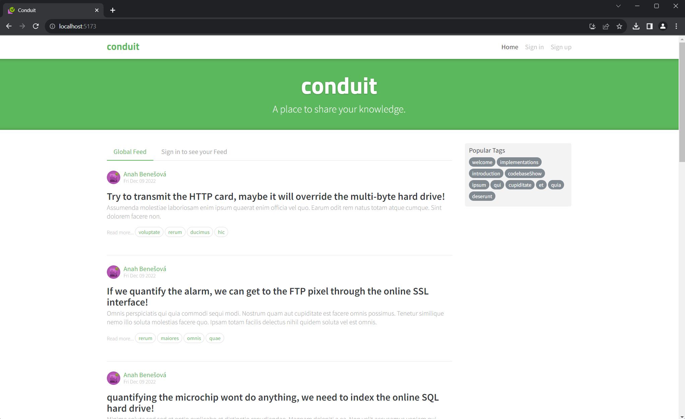

# Using WSL & VSCode

## Running a simple project

Let's try out our new set up and try running a project using Visual Studio Code & Windows Subsystem for Linux.

In this, we will be using the Windows Filesystem to store files, and Windows Subsystem for Linux to run the application using NodeJS.

## Clone a project

Using your favourite Git client, clone the [sveltejs/realworld](https://github.com/sveltejs/realworld) project. We will be using this as an example application to run.

Open up this project's files in Visual Studio Code and open a terminal.

## Run the code

In the WSL terminal, enter `npm install` to install the dependencies.

Enter `npm run dev` and the app should run inside WSL.

Visit http://localhost:5173 in your usual browser and you will be able to access the application in Windows when it is running on the Linux Subsystem!

