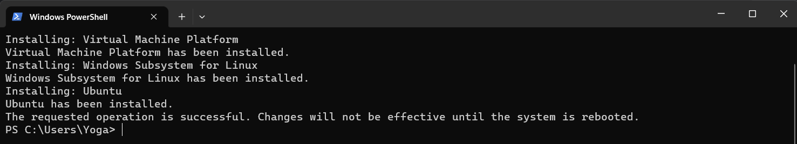

# Install WSL

## Installing WSL

To install Windows Subsystem for Linux, open up Powershell on your PC and enter the below.

```
wsl --install
```




If you run into any issues with this, see the [Troubleshooting Guide](https://learn.microsoft.com/en-us/windows/wsl/troubleshooting).