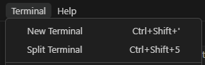
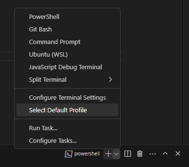
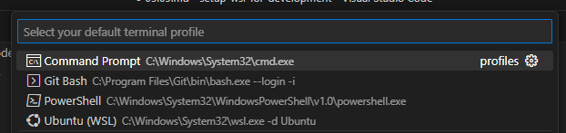

# Setting up VS Code with WSL

## Getting Started 

Before starting, make sure you have installed [Visual Studio Code](https://code.visualstudio.com/) to your PC.

Visual Studio Code, along with the WSL extension, enables you to use WSL as your full-time development environment directly from VS Code.

## Installing the Remote Development Extension

Go to the [Remote Development](https://marketplace.visualstudio.com/items?itemName=ms-vscode-remote.vscode-remote-extensionpack) page and press Install. It will prompt you to open Visual Studio Code.

[Open VSCode Prompt](img/8-open-vscode.png)

This will open Visual Studio Code and here you can press Install.

[Remote development in VS Code](img/9-install-remote-dev.png)

## Setting WSL as defualt terminal

Open a terminal window inside VS Code by pressing Terminal -> New Terminal in the toolbar.

This should open a powershell terminal. To change the default to your WSL terminal, click the arrow beside the new terminal option, at the top right of the terminal, and choose `Select Default Profile`.

You are then prompted to select the default profile. Here, choose `Ubuntu (WSL)` as default.

Go ahead and open an new terminal, and it will be using WSL as default!